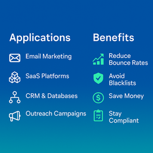
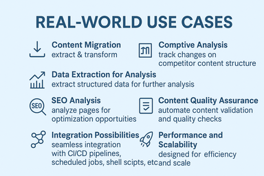

Welcome to my portfolio.

<!-- TOC start -->

# Table of Contents
- [CloudBees CD/RO Platform Component Development](#cloudbees-cdro-platform-component-development)
   * [**English**](#english1)
   * [**Українська**](#ukrainian1)
- [Telecom BSS Billing Core Components](#telecom-bss-billing-core-components)
   * [**English**](#english2)
   * [**Українська**](#ukrainian2)
- [Enterprise Email Platform Complete Redesign](#enterprise-email-platform-complete-redesign)
   * [**English**](#english3)
   * [**Українська**](#ukrainian3)

<!-- TOC end -->

---

## [CloudBees CD/RO Platform Component Development](/portfolio/devops_cd_ro_automation/)

* [Fiverr](https://www.fiverr.com/pere_val/develop-custom-web-scraping-solutions-for-data-extraction)
* [FreelanceHunt](https://freelancehunt.com/freelancer/valpere.html)

### **English**

### **Українська**

---

## [Telecom BSS Billing Core Components](/portfolio/hi_lo_telco_backend/)

* [Fiverr](https://www.fiverr.com/pere_val/build-an-enterprisegrade-email-validation-cli-tool)
* [FreelanceHunt](https://freelancehunt.com/freelancer/valpere.html)

### **English**

### **Українська**

---

## [Enterprise Email Platform Complete Redesign](/portfolio/email_service_redesign/)

* [Fiverr](https://www.fiverr.com/pere_val/help-you-extract-analyze-and-transform-web-content-like-a-pro)
* [FreelanceHunt](https://freelancehunt.com/freelancer/valpere.html)

### **English**

### **Українська**
