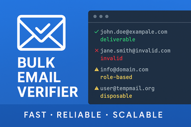
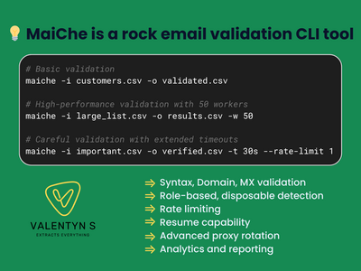

# Інструмент перевірки електронної пошти

* [Fiverr](https://www.fiverr.com/pere_val/build-an-enterprisegrade-email-validation-cli-tool)
* [FreelanceHunt](https://freelancehunt.com/freelancer/valpere.html#portfolio)

[The same in English](../mai_che/)

## Короткий огляд


Інструмент CLI корпоративного рівня для перевірки електронної пошти: валідація синтаксису, домену та стану поштової скриньки. Видаляє недійсні, одноразові та рольові адреси, зменшує кількість відмов та захищає репутацію відправника.

**MaiChe** — це інструмент командного рядка для перевірки електронної пошти професійного рівня, побудований на Go для виняткової продуктивності та точності. Він перевіряє адреси електронної пошти через кілька етапів верифікації — перевірку синтаксису, верифікацію домену/MX-записів та SMTP-перевірку поштової скриньки — без відправлення реальних листів.

### Ключові переваги

- **Точність верифікації 95%+** через багатоетапну перевірку
- **Обробка 10 000+ листів на годину** завдяки паралельній обробці
- **Жодного відправленого листа** — SMTP-верифікація без ризику спаму
- **Комплексне виявлення** недійсних, рольових та одноразових адрес
- **Готовність до корпоративного використання** з підтримкою проксі, відновленням та детальною аналітикою

### Доступні пакети

**Базовий пакет** — Основна перевірка для невеликих списків до 10 000 адрес

- Основні функції перевірки (синтаксис, домен, MX, SMTP)
- Підтримка введення/виведення CSV
- 10 паралельних воркерів
- Доставка за 3 дні

**Стандартний пакет** — Професійні функції для зростаючого бізнесу

- Все з Базового плюс:
- Підтримка одного проксі
- База даних SQLite для відстеження історії
- Відновлення після перерваних завдань
- Повторна перевірка невдалих адрес
- До 50 000 листів
- Доставка за 6 днів

**Преміум пакет** — Рішення корпоративного рівня

- Все зі Стандартного плюс:
- Ротація декількох проксі
- Розширена оптимізація продуктивності
- Детальна аналітика та звітність
- До 100 000 листів
- Доставка за 10 днів

**Розширений пакет (Кастомна ціна)** — Адаптовані корпоративні рішення

- Кастомні правила перевірки
- Режим REST API або RPC-сервісу
- Docker-контейнеризація
- Інтеграція зовнішніх баз даних
- Кастомні панелі звітності
- Виділена підтримка

*Примітка: Деталі щодо вартості преміум пакетів та кастомних функцій доступні за посиланням "[I will build an enterprisegrade email validation cli tool](https://www.fiverr.com/pere_val/build-an-enterprisegrade-email-validation-cli-tool)".*


---

## Детальний огляд

### Що таке MaiChe?

MaiChe — це високопродуктивний інструмент командного рядка (CLI) для перевірки електронної пошти, розроблений для вирішення однієї з найбільш стійких проблем цифрового маркетингу: підтримки чистих, придатних для доставки списків електронних адрес. Побудований на мові програмування Go, MaiChe використовує паралельну обробку та інтелектуальне управління ресурсами для масштабної перевірки адрес електронної пошти при збереженні виняткової точності.

На відміну від простих перевірювачів синтаксису або базових сервісів перевірки, MaiChe виконує глибоку верифікацію через реальні SMTP-з'єднання з поштовими серверами, підтверджуючи не лише правильне форматування адреси, але й те, що поштова скринька справді існує та може отримувати пошту — без відправлення жодного листа.

### Бізнес-обґрунтування перевірки електронної пошти

Щороку приблизно 22,5% адрес електронної пошти стають недійсними через зміну роботи, покинуті облікові записи або деактивовані домени. Для бізнесу, що покладається на email-маркетинг, це занепад призводить до:

- **Фінансових втрат** від відправлення на неіснуючі адреси
- **Пошкодження репутації відправника**, що призводить до потрапляння в папку зі спамом
- **Спотвореної аналітики**, що ускладнює вимірювання ефективності кампаній
- **Потенційного занесення до чорного списку** через надмірну кількість відмов

MaiChe вирішує ці проблеми, надаючи перевірку корпоративного рівня, яка виходить за рамки базових перевірок.

### Як працює MaiChe

#### 1. Багатоетапний конвеєр перевірки

MaiChe обробляє кожну електронну адресу через складний конвеєр перевірки:

**Перевірка синтаксису**

- Перевірка відповідності RFC 5322
- Валідація структури локальної частини та домену
- Перевірка спеціальних символів та довжини
- Обробка крайніх випадків (рядки в лапках, екрановані символи)

**Верифікація домену**

- DNS-пошук для перевірки існування домену
- Перевірка MX-записів для поштових можливостей
- Інтелектуальне кешування для зменшення повторних запитів
- Підтримка кастомних DNS-серверів для обмежених середовищ

**SMTP-верифікація**

- Встановлює з'єднання з цільовим поштовим сервером
- Виконує переговори EHLO/HELO
- Виконує команди MAIL FROM та RCPT TO
- Аналізує відповіді сервера для визначення статусу поштової скриньки
- Жодної фактичної доставки електронної пошти — повністю безпечно

**Шар інтелекту**

- Виявлення рольових адрес (admin@, support@ тощо)
- Ідентифікація одноразових електронних адрес
- Виявлення доменів catch-all
- Аналіз шаблонів для підозрілих адрес

#### 2. Архітектура продуктивності

- **Паралельна обробка**: Налаштовувані пули воркерів обробляють декілька листів одночасно
- **Розумне обмеження швидкості**: Обмеження на домен запобігає блокуванню сервера
- **Пулінг з'єднань**: Повторне використання SMTP-з'єднань для ефективності
- **Потокова обробка**: Обробляє файли будь-якого розміру без обмежень пам'яті

### Реальні приклади використання



#### Очищення списку електронної пошти e-commerce

Інтернет-магазин з 500 000 електронних адрес клієнтів використовує MaiChe щоквартально для очищення списку перед великими рекламними кампаніями. Результати:

- Зниження рівня відмов з 12% до 0,8%
- Покращення доставляємості на 25%
- Економія $3 000 за кампанію у витратах ESP
- Збільшення відкритості на 18%

#### Онбординг користувачів SaaS

Платформа B2B SaaS інтегрує MaiChe для перевірки електронних адрес під час реєстрації користувача:

- Виявляє помилки друку до створення облікового запису
- Зменшує кількість звернень до підтримки на 40%
- Покращує конверсію від пробного до платного на 15%
- Запобігає створенню фіктивних облікових записів

#### Управління списками маркетингового агентства

Агентство цифрового маркетингу, що управляє 50+ клієнтськими кампаніями, використовує MaiChe для:

- Перевірки списків перед імпортом до ESP
- Надання клієнтам звітів про якість списків
- Підтримки репутації відправника по всіх акаунтах
- Зменшення відтоку клієнтів завдяки кращій ефективності кампаній

### Деталі пакетів та функцій



#### Базовий пакет — Основна перевірка

Ідеальний для малого бізнесу, стартапів або індивідуальних маркетологів.

**Функції:**

- Обробка до 10 000 листів
- Основний конвеєр перевірки (синтаксис, домен, MX, SMTP)
- Введення/виведення CSV-файлів
- 10 паралельних воркерів для швидкої обробки
- Обмеження швидкості для дотримання лімітів сервера
- Логування в консоль та файл
- Автоматичне повторення при тимчасових збоях
- Підсумковий звіт зі статистикою

**Приклад команди:**

```bash
maiche -i customers.csv -o validated.csv
```

#### Стандартний пакет — Професійні функції

Розроблений для зростаючого бізнесу з більшими списками та більш складними потребами.

**Додаткові функції:**

- Обробка до 50 000 листів
- Підтримка одного проксі для розширеного тестування доставляємості
- База даних SQLite для історії перевірки
- Відновлення після перерваних завдань
- Повторна перевірка конкретних статусів (повторення невдалих)
- Розширене логування з ротацією
- Декілька форматів виводу

**Приклади команд:**

```bash
# Початкова перевірка з проксі
maiche -c config.yaml -i large_list.csv -o results.csv

# Повторна перевірка раніше невдалих адрес
maiche -i large_list.csv -o results.csv -r "invalid,timeout"
```

#### Преміум пакет — Корпоративне рішення

Повнофункціональне рішення для організацій, що потребують максимальної продуктивності та надійності.

**Додаткові функції:**

- Обробка до 100 000 листів
- Ротація декількох проксі з моніторингом стану
- Розширена оптимізація продуктивності
- Детальна аналітична панель
- Можливості кастомної звітності
- Пріоритетна підтримка

**Розширені можливості:**

- Стратегії проксі: кругова, випадкова або найменш використовувана
- Автоматичне виявлення та відновлення після збоїв проксі
- Метрики перевірки в реальному часі
- Аналіз історичних тенденцій
- Експорт у декілька форматів (CSV, JSON, Excel)

#### Розширений пакет — Кастомне корпоративне (Кастомна ціна)

Адаптовані рішення для організацій з конкретними вимогами, що виходять за рамки стандартних пакетів.

**Можливі кастомізації:**

- **Режим REST API/RPC-сервісу**: Перетворення MaiChe на мікросервіс
- **Кастомні правила перевірки**: Галузева або корпоративна логіка перевірки
- **Інтеграція зовнішніх баз даних**: Підключення до PostgreSQL, MySQL або кастомних баз даних
- **Docker-контейнеризація**: Легке розгортання в хмарних середовищах
- **Розширена аналітика**: Кастомні панелі та звітність
- **Інтеграція робочих процесів**: Підключення до існуючих інструментів та процесів

### Технічні специфікації

**Метрики продуктивності:**

- Обробка 10 000+ листів на годину на стандартному обладнанні
- Точність перевірки синтаксису 99%+
- Точність SMTP-перевірки 95%+
- Використання пам'яті: ~50 МБ для обробки 100 000 листів
- Налаштовуваний паралелізм: 1-100+ воркерів

**Системні вимоги:**

- Операційні системи: Windows, macOS, Linux
- Пам'ять: мінімум 512 МБ, рекомендовано 2 ГБ
- Сховище: 100 МБ для програми + зберігання даних
- Мережа: Стабільне підключення до Інтернету для SMTP-верифікації

**Безпека та відповідність:**

- Вміст електронної пошти не отримується та не зберігається
- Дані обробляються локально — ніколи не залишають вашу інфраструктуру
- Налаштовуване логування для аудиторських слідів
- Архітектура, сумісна з GDPR, CCPA та LGPD
- Опціональне шифрування для конфіденційних операцій

### ROI та бізнес-вплив

**Негайні переваги:**

- Зниження витрат на відправлення електронної пошти на 15-30%
- Покращення рівнів доставляємості на 20-40%
- Зменшення рівнів відмов до менш ніж 2%
- Збільшення показників залученості на 10-25%

**Довгострокова цінність:**

- Захист репутації відправника та авторитету домену
- Покращення ROI email-маркетингу
- Краща якість даних клієнтів
- Зменшення навантаження на підтримку від відхилених листів

### Підтримка та майбутній розвиток

Всі пакети включають:

- Вичерпну документацію
- Покрокове керівництво з впровадження
- Підтримку електронною поштою для технічних питань
- Регулярні оновлення для виявлення одноразових доменів

**Заплановані вдосконалення:**

- Машинне навчання для прогностичної перевірки
- Інтеграція блокчейну для сертифікатів перевірки
- Крайове розгортання для розподіленої обробки
- Розширене управління лімітами API

### Початок роботи

Виберіть пакет, що найкраще відповідає вашим потребам:

- **Базовий**: Для списків до 10 000 адрес зі стандартними потребами перевірки
- **Стандартний**: Для зростаючого бізнесу, якому потрібна історія та підтримка проксі
- **Преміум**: Для великих операцій, що потребують максимальної продуктивності
- **Розширений**: Для кастомних вимог та корпоративної інтеграції

Готові покращити доставляємість електронної пошти та захистити свою репутацію відправника? MaiChe надає перевірку професійного рівня, яка потрібна вашому бізнесу для успіху в email-маркетингу.
